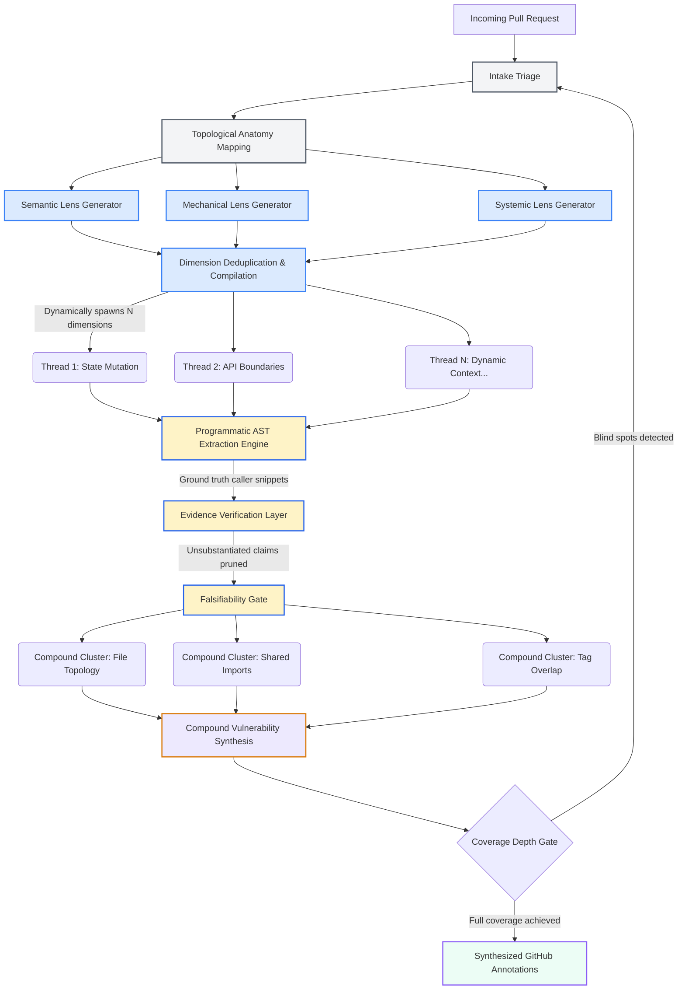
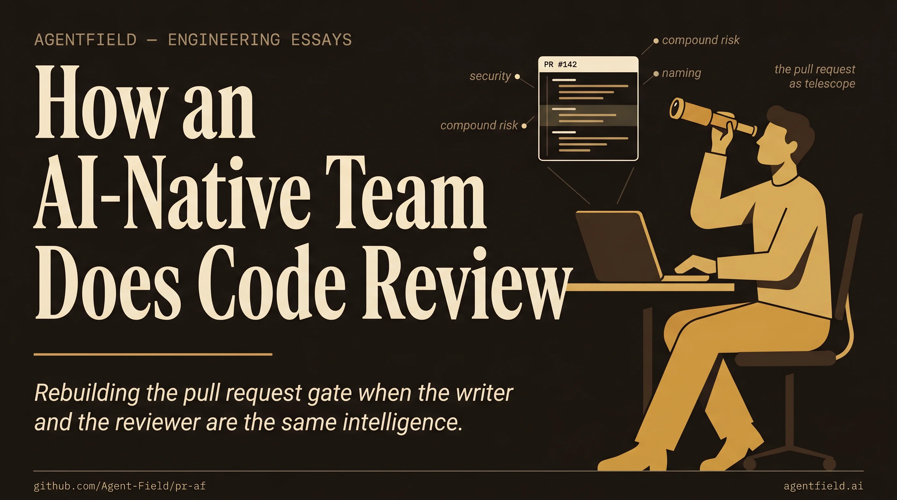

<div align="center">

# PR-AF

### Open-Source Agentic PR Reviewer Built on [AgentField](https://github.com/Agent-Field/agentfield)

[](LICENSE)
[](https://www.python.org/downloads/)
[](https://github.com/Agent-Field/agentfield)
[](https://github.com/Agent-Field)

<p>
  <a href="#what-you-get-back">Output</a> •
  <a href="#how-it-works">How It Works</a> •
  <a href="#comparison">Comparison</a> •
  <a href="#quick-start">Quick Start</a> •
  <a href="docs/ARCHITECTURE.md">Architecture</a>
</p>

</div>

Other tools run a single LLM pass over the diff with a fixed checklist. PR-AF **builds a custom review strategy for every PR**: it examines the change, reasons about what could go wrong, spawns parallel reviewer agents with runtime-crafted prompts, challenges its own findings adversarially, and posts specific inline comments. Free, open source, one API call. A deep review of a 500-line PR costs about **$0.80 in LLM calls**.

<p align="center">
  
</p>

## One-Call DX

```bash
curl -X POST http://localhost:8080/api/v1/execute/async/pr-af.review \
  -H "Content-Type: application/json" \
  -d '{"input": {"pr_url": "https://github.com/owner/repo/pull/123"}}'
```

Posts inline GitHub review comments with evidence-grounded findings:

```jsonc
{
  "total_findings": 5,
  "by_severity": {"critical": 1, "important": 2, "suggestion": 2},
  "findings": [
    {
      "severity": "critical",
      "title": "SQL injection in user input handling",
      "file": "src/api/users.py",
      "line": 42,
      "body": "Raw query parameter interpolated directly into SQL. Tracer confirms no parameterization between input and cursor.execute().",
      "suggestion": "cursor.execute('SELECT * FROM users WHERE id = %s', (user_id,))",
      "evidence": "AST extraction confirms f-string SQL at users.py:42, no sanitization in call chain",
      "compound_risk": "Combined with missing auth middleware (finding #2), this is exploitable by unauthenticated users"
    }
  ],
  "review_dimensions": 4,
  "cost_usd": 0.83
}
```

Custom review strategy per PR. Evidence-grounded. Zero false positives. ~$0.80 for a 500-line PR.

---

## Dynamic Pipeline Architecture

PR-AF does not execute a static script. It structurally morphs its own execution graph based on the topology of the incoming Pull Request.

When a PR arrives, the system dynamically compiles review dimensions — evaluating the diff through semantic, mechanical, and systemic lenses. It uses these dimensions to spawn specialized, ephemeral reviewer agents tailored exclusively to the exact context of the current PR.

<p align="center">
  
</p>

> Full architecture deep-dive: [`docs/ARCHITECTURE.md`](docs/ARCHITECTURE.md)

<details>
<summary><strong>Pipeline flow (Mermaid)</strong></summary>



</details>

---

## How It Works

PR-AF uses this multi-phase cognitive pipeline to ensure rigorous, high-fidelity reviews:

### 1. Evidence Grounding (0% False Positives)
Language models inherently operate on probability, which leads to assumption-based false positives. If the system flags a missing validation check, PR-AF does not immediately accept it. Instead, it utilizes programmatic AST (Abstract Syntax Tree) extraction to pull the exact caller snippets and import contexts from the broader repository. This raw data is then evaluated through an isolated verification layer. If the initial claim cannot be irrefutably grounded in the extracted code, it is silently pruned.

### 2. Compound Vulnerability Synthesis
Standard tools analyze code linearly. PR-AF looks at the entire board to identify cross-correlated risks. It clusters isolated, seemingly minor anomalies across different files and evaluates them concurrently to detect whether they coalesce into a larger systemic exploit. For example, identifying an unprotected API key in one module and a database merge vulnerability in another will be synthesized into a single, high-severity "Coordinated Injection" finding.

### 3. Falsifiability Gates
Before any finding is compiled into the final GitHub comment, it must pass through a strict falsifiability framework. The system actively attempts to invalidate its own findings—searching for reasons why the reported anomaly might be safe, intended behavior, or securely mitigated elsewhere in the codebase structure. Only findings that survive this aggressive auto-invalidation process are surfaced to the developer.

---

## Ecosystem Comparison

There are excellent AI code review tools on the market. PR-AF is not designed to replace fast, interactive tools; it is designed for comprehensive CI/CD gating where accuracy and architectural depth matter more than execution speed.

| Feature | PR-AF (AgentField) | Claude Code CLI | Commercial SaaS (e.g. Codex, CodeRabbit) |
|---|---|---|---|
| **Best For** | Deep CI/CD architectural audits | Fast, iterative inner-loop development | Clean GitHub UX and chat-based reviews |
| **Cost** | **Free / Open Source** (BYOK API costs only) | Pay-per-token (BYOK) | ~$20 - $25 / user / month |
| **Architecture** | Massively parallel cognitive pipeline | Single-thread interactive loop | Context retrieval + LLM review |
| **Execution Time**| ~35-50 minutes | Seconds to minutes | ~2-5 minutes |
| **False Positives**| **Extremely low** (Evidence Grounding) | Moderate (relies on context window) | Low-to-Moderate (heuristic filtering) |
| **Compound Risks**| **Yes** (Dedicated Compound Synthesizer) | Unlikely (diff-focused) | Partial (depends on retrieval accuracy) |

*We highly recommend using Claude Code for your local development and running PR-AF as your final GitHub Actions gatekeeper.*

---

## Quick Start

```bash
git clone https://github.com/Agent-Field/pr-af.git && cd pr-af
cp .env.example .env          # Add OPENROUTER_API_KEY, GH_TOKEN
docker compose up --build
```

Starts AgentField control plane (`http://localhost:8080`) + PR-AF agent.

```bash
curl -X POST http://localhost:8080/api/v1/execute/async/pr-af.review \
  -H "Content-Type: application/json" \
  -d '{"input": {"pr_url": "https://github.com/owner/repo/pull/123"}}'
```

Poll for results:

```bash
curl http://localhost:8080/api/v1/executions/<execution_id>
```

## GitHub Actions Integration

The easiest way to use PR-AF is to drop it into your GitHub Actions. It requires **zero configuration** and runs securely using GitHub's built-in `GITHUB_TOKEN`.

Add this workflow to your repository at `.github/workflows/pr-af-review.yml`. It triggers automatically whenever you add the **`pr-af`** label to a Pull Request.

```yaml
name: AgentField PR Review

on:
  pull_request:
    types: [labeled]

jobs:
  pr-af-review:
    if: github.event.label.name == 'pr-af'
    runs-on: ubuntu-latest

    # Needs permissions to post comments and read code
    permissions:
      contents: read
      pull-requests: write

    steps:
      - name: Checkout PR-AF
        uses: actions/checkout@v4
        with:
          repository: Agent-Field/pr-af
          path: pr-af

      - name: Start AgentField & PR-AF
        working-directory: ./pr-af
        env:
          OPENROUTER_API_KEY: ${{ secrets.OPENROUTER_API_KEY }}
          GH_TOKEN: ${{ secrets.GITHUB_TOKEN }}
        run: |
          docker compose up -d
          sleep 15 # Wait for services to be healthy

      - name: Execute Deep Architectural Audit
        working-directory: ./pr-af
        env:
          PR_URL: ${{ github.event.pull_request.html_url }}
        run: |
          python3 scripts/ci_runner.py
```

*Note: PR-AF runs a comprehensive parallel pipeline. Reviews typically take 35-50 minutes depending on PR complexity.*

---

## From the AgentField Blog

### [How an AI-Native Engineering Team Does Code Review](https://www.agentfield.ai/blog/ai-native-code-review?utm_source=github-readme&utm_campaign=pr-af-readme&utm_id=pr-af-readme-blog-ai-native-code-review)

When the writer and the reviewer are the same intelligence, the pull request gate stops doing what it was designed to do.

<p align="center">
  <a href="https://www.agentfield.ai/blog/ai-native-code-review?utm_source=github-readme&utm_campaign=pr-af-readme&utm_id=pr-af-readme-blog-ai-native-code-review">
    
  </a>
</p>

[Read the post →](https://www.agentfield.ai/blog/ai-native-code-review?utm_source=github-readme&utm_campaign=pr-af-readme&utm_id=pr-af-readme-blog-ai-native-code-review)
